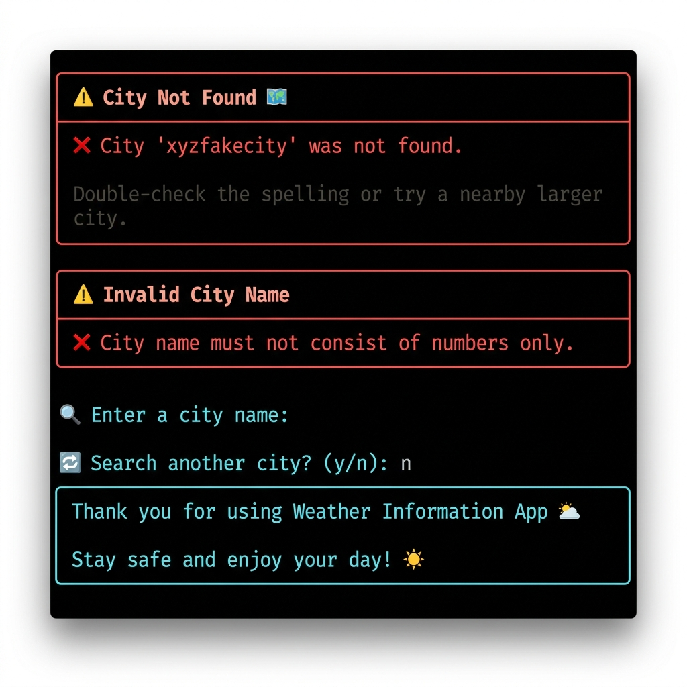

<div align="center">

# 🌤 Weather Information App

**A modern, production-ready command-line weather application powered by OpenWeatherMap.**


</div>

---

## 📋 Table of Contents

- [Overview](#-overview)
- [Features](#-features)
- [Screenshots](#-screenshots)
- [Architecture](#-architecture)
- [Data Flow](#-data-flow)
- [Project Structure](#-project-structure)
- [Installation](#-installation)
- [Environment Setup](#-environment-setup)
- [Usage](#-usage)
- [Example Output](#-example-output)
- [Error Handling](#-error-handling)
- [Testing](#-testing)
- [Security Notes](#-security-notes)
- [Future Improvements](#-future-improvements)
- [License](#-license)
- [Author](#-author)

---

## 🌍 Overview

**Weather Information App** is a fully-featured, production-grade command-line application that delivers real-time weather data for any city in the world. Built with clean architecture, modular design, and professional Python coding standards, it demonstrates what an internship-level Python project looks like in practice.

The app communicates with the [OpenWeatherMap Current Weather API](https://openweathermap.org/current), parses and validates every field, and renders a beautiful, coloured dashboard using the [Rich](https://github.com/Textualize/rich) terminal UI library — all without a single ugly traceback reaching the user.

---

## ✨ Features

| Category | Feature |
|---|---|
| 🌡 **Weather Data** | Temperature, Feels Like, Min/Max Temp, Humidity, Pressure, Visibility |
| 🌬 **Wind** | Speed (m/s) and Cardinal Direction (N, NE, SSW, …) |
| 🌅 **Astronomical** | Sunrise & Sunset times (city-local timezone) |
| 📍 **Location** | City name, Country, Latitude, Longitude |
| 🕐 **Time** | Timezone offset, Last-updated timestamp |
| 🎨 **UI** | Rich panels, tables, icons, colours, emoji, borders |
| 🔒 **Security** | API key via `.env` only — never hardcoded |
| 📝 **Logging** | Rotating log file, configurable levels |
| ✅ **Tests** | 149 pytest cases, mocked HTTP, offline |
| 🛡 **Errors** | 7 custom exceptions, user-friendly error panels |
| 🔍 **Validation** | City name rules: blank, numbers-only, symbols, length, Unicode |

---

## 📸 Screenshots

### Main Weather Dashboard


### Error Handling & Goodbye Screen



<!-- Additional screenshots removed — repository uses two demo images: demo1.png and demo2.png -->

---

## 🏗 Architecture

The application follows the **Separation of Concerns** principle with five distinct layers:

```
┌─────────────────────────────────────────────────────────┐
│                    weather_app.py                       │
│              (Orchestration / Entry Point)               │
└───────────────────────┬─────────────────────────────────┘
                        │ calls
          ┌─────────────┼─────────────┐
          ▼             ▼             ▼
  ┌──────────────┐ ┌──────────┐ ┌──────────┐
  │weather_service│ │ parser   │ │ display  │
  │  (Network)   │ │ (Parse)  │ │  (Rich)  │
  └──────┬───────┘ └──────────┘ └──────────┘
         │
  ┌──────▼───────┐
  │  OpenWeather │
  │     Map API  │
  └──────────────┘

  ┌──────────────┐ ┌──────────┐ ┌──────────┐
  │  exceptions  │ │  config  │ │  logger  │
  │  (Domain)    │ │  (Env)   │ │  (I/O)   │
  └──────────────┘ └──────────┘ └──────────┘
```

| Module | Responsibility |
|---|---|
| `weather_app.py` | Entry point, interactive loop, top-level error handling |
| `weather_service.py` | HTTP requests, input validation, HTTP-error dispatch |
| `parser.py` | Stateless JSON → `WeatherData` transformation |
| `display.py` | All terminal output (Rich panels, tables, prompts) |
| `config.py` | API constants, `load_api_key()` |
| `exceptions.py` | Custom exception hierarchy |
| `logger.py` | Rotating-file + console logging setup |

---

## 🔄 Data Flow

```
User Input
    │
    ▼
validate_city()          ← weather_service.py
    │
    │  ValueError on bad input → display_error()
    │
    ▼
fetch_weather()          ← weather_service.py
    │  GET /data/2.5/weather?q={city}&appid={key}&units=metric
    │
    │  HTTP errors → domain exceptions → display_error()
    │
    ▼
parse_weather()          ← parser.py
    │  raw dict → WeatherData (flat, typed)
    │
    │  ParsingError → display_error()
    │
    ▼
display_weather()        ← display.py
    │  Rich panels + tables → terminal
    │
    ▼
prompt_continue()        ← display.py
    │  y → repeat | n → display_goodbye() → exit
```

---

## 📁 Project Structure

```
weather-information-app/
│
├── weather_app.py        # Entry point & main loop
├── weather_service.py    # Network layer & input validation
├── parser.py             # Pure JSON parser
├── display.py            # Rich terminal UI
├── config.py             # Configuration & API key loader
├── exceptions.py         # Custom exception hierarchy
├── logger.py             # Centralised logging
│
├── requirements.txt      # Pinned dependencies
├── README.md             # This file
├── LICENSE               # MIT License
├── CHANGELOG.md          # Version history
├── .gitignore            # Git ignore rules
├── .env.example          # Environment template (safe to commit)
│
├── tests/
│   ├── __init__.py
│   ├── test_api.py        # Mocked HTTP tests
│   ├── test_parser.py     # Parser unit tests
│   ├── test_display.py    # Rich output tests
│   └── test_validation.py # City validation tests
│
└── screenshots/
    ├── demo1.png          # Main dashboard
    └── demo2.png          # Error handling
```

---

## 🚀 Installation

### Prerequisites

- Python 3.10 or higher
- `pip` package manager
- A free [OpenWeatherMap API key](https://home.openweathermap.org/users/sign_up)

### Steps

```bash
# 1. Clone the repository
git clone https://github.com/your-username/weather-information-app.git
cd weather-information-app

# 2. Create and activate a virtual environment
python -m venv venv

# On Windows
venv\Scripts\activate

# On macOS / Linux
source venv/bin/activate

# 3. Install dependencies
pip install -r requirements.txt
```

---

## 🔑 Environment Setup

```bash
# 4. Copy the template and add your API key
cp .env.example .env
```

Open `.env` in any text editor and replace the placeholder:

```dotenv
WEATHER_API_KEY=your_actual_api_key_here
```

> **Get a free API key:** Sign up at [openweathermap.org](https://home.openweathermap.org/users/sign_up).
> New keys are activated within a few minutes.

---

## 💻 Usage

```bash
python weather_app.py
```

Follow the interactive prompts:

1. The welcome banner is displayed.
2. Enter a city name (e.g. `London`, `Tokyo`, `São Paulo`).
3. The weather dashboard is rendered instantly.
4. Answer `y` to search another city, or `n` to exit.

### Keyboard shortcuts

| Key | Action |
|---|---|
| `Ctrl + C` | Exit gracefully at any prompt |
| `Ctrl + D` | Exit gracefully at any prompt (Unix) |

---

## 📊 Example Output

```
╭─────────────────────────────────────────────────────────╮
│        🌤  Weather Information App  🌤                   │
│  v1.0.0  •  Real-time weather powered by OpenWeatherMap  │
╰─────────────────────────────────────────────────────────╯

╭─────────────────────────────────────────────────────────╮
│          📍 London, GB                                   │
│  🛰  51.5085°N  -0.1257°E   •   🕐 Updated: 10:30:00    │
╰─────────────────────────────────────────────────────────╯

╭──────────────── ☁  Clear ────────────────╮
│              ☀️  Clear sky                │
│        18.5 °C   Feels like  17.9 °C     │
│     Low 15.2 °C   •   High  21.3 °C      │
╰──────────────────────────────────────────╯

╭─── 🌡 Atmosphere ───╮  ╭─── 🌬 Wind & Sun ───╮
│ Temperature  18.5°C │  │ Wind Speed  4.1 m/s │
│ Humidity        62% │  │ Direction       SW  │
│ Pressure    1015hPa │  │ Sunrise    06:42 AM │
│ Visibility   10.0km │  │ Sunset     04:18 PM │
╰─────────────────────╯  ╰─────────────────────╯
```

---

## 🛡 Error Handling

The app handles every failure gracefully with styled error panels:

| Scenario | Exception | User Message |
|---|---|---|
| Missing `.env` / `WEATHER_API_KEY` | `APIKeyMissingError` | "API key not found." |
| Revoked or wrong API key | `InvalidAPIKeyError` | "Your API key is invalid or has been revoked." |
| City not in OWM database | `CityNotFoundError` | "City 'X' was not found." |
| Network down / DNS failure | `ConnectionError` | "Unable to connect to the weather service." |
| Request timeout | `ConnectionError` | "The request timed out." |
| API rate limit exceeded | `RateLimitError` | "API rate limit exceeded." |
| OWM server error | `WeatherAPIError` | "The weather service is currently unavailable." |
| Malformed API response | `ParsingError` | "Failed to parse weather data." |
| Blank city entry | `ValueError` | "City name must not be blank." |
| Numbers-only city | `ValueError` | "City name must not consist of numbers only." |
| Ctrl+C / Ctrl+D | `KeyboardInterrupt` | Goodbye screen, clean exit |

No Python tracebacks are ever shown to the user.

---

## 🧪 Testing

The project ships with **149 test cases** spread across four test modules.

### Run all tests

```bash
pytest tests/ -v
```

### Run with coverage report

```bash
pytest tests/ -v --cov=. --cov-report=term-missing
```

### Run a specific test module

```bash
pytest tests/test_parser.py -v
pytest tests/test_validation.py -v
pytest tests/test_api.py -v
pytest tests/test_display.py -v
```

### Test coverage summary

| Module | Tests | Coverage Areas |
|---|---|---|
| `test_parser.py` | 30+ | Parsing, `convert_time`, `weather_icon`, `wind_direction`, `_safe_get` |
| `test_validation.py` | 25+ | Blank, numbers, symbols, length, Unicode, whitespace stripping |
| `test_api.py` | 15+ | HTTP 200/401/404/429/500, timeouts, DNS errors, invalid JSON |
| `test_display.py` | 20+ | Banner, dashboard, error panel, formatters, timezone |

---

## 🔐 Security Notes

1. **API Key** is stored in `.env` and loaded via `python-dotenv` — never hardcoded.
2. **`.env` is git-ignored** — it will never be committed accidentally.
3. **`.env.example`** contains only a placeholder and is safe to publish.
4. All secrets are read through `os.getenv()` with explicit empty-string detection.
5. No credentials are written to logs.

---

## 🔮 Future Improvements

- **5-day forecast** using the `/forecast` endpoint with a Rich progress bar.
- **Air Quality Index** from the OpenWeatherMap Air Pollution API.
- **Search history** stored locally in a SQLite database.
- **Export** weather data as JSON or CSV.
- **City autocomplete** with fuzzy matching (`rapidfuzz`).
- **Unit switching** (metric / imperial / standard) via a CLI flag.
- **Async fetching** with `httpx` and `asyncio` for concurrent multi-city lookup.
- **Docker support** for containerised distribution.

---

## 📄 License

This project is licensed under the **MIT License** — see the [LICENSE](LICENSE) file for details.

---

## 👤 Author

**Weather App**

- GitHub: [@your-username](https://github.com/your-username)
- LinkedIn: [your-linkedin](https://linkedin.com/in/your-linkedin)

---

<div align="center">

⭐ **If this project helped you, please give it a star!** ⭐

Made with ❤️ and ☕ using Python & Rich

</div>
